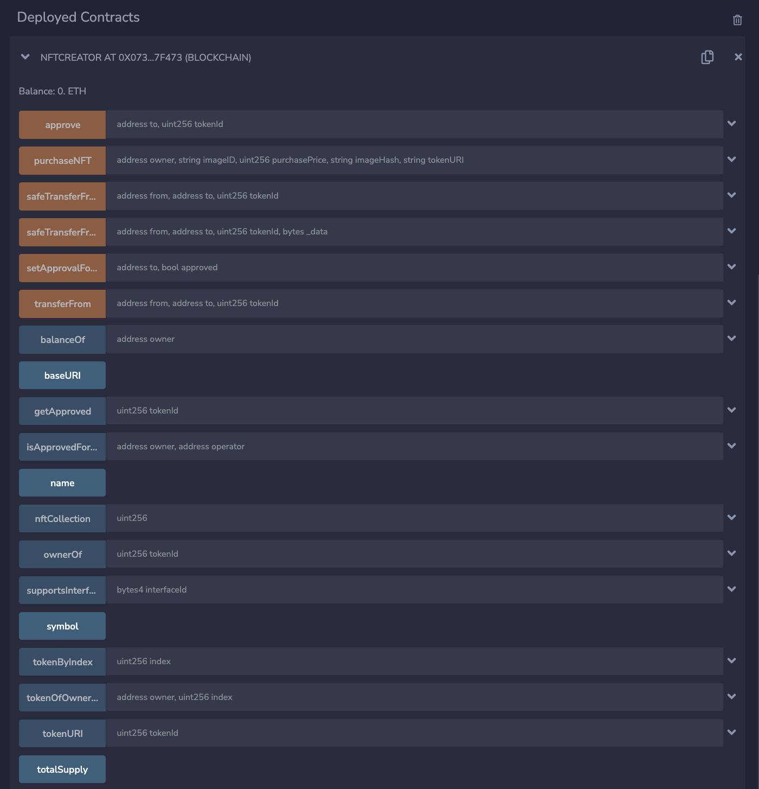

# FinTech Capstone Project - AI ART Revolutionizing NFTs by *Team Ripples*

## Table of Contents
* [Summary](#summary)
* [Software and Technologies](#software-and-technologies-used)
* [Usage and Installation](#usage-and-installation)
* [Future Improvements](future-improvements)
* [Files](#files)
* [Team Information](#team-information)

## Summary

Over the last few years, two groundbreaking concepts have emerged as pinnacles of innovation. Non-Fungible Tokens, or NFTs have taken the world by storm, revolutionizing ownership and authenticity in the digital space. These unique cryptographic tokens, built on blockchain technology allow for the creation of one-of-a-kind verifiable digital assets. Simultaneously, humans are just scraping the surface of what’s possible with Artificial Intelligence, or AI. Machine learning algorithms, natural language processing, and other forms of Artificial Intelligence have the opportunity to transform industries in years to come. This project serves to marry the two concepts into one cohesive use case. 

We’ve created a platform where users can effortlessly generate tokens of personalized artwork. By simply typing in their preferences, users can harness the power of Artificial Intelligence to craft and mint distinct NFT images on the blockchain. To do this, we created a  smart contact using a mixture of Python and Solidity, while utilizing Streamlit as the user’s frontend interface. 
 
The marrying of NFTs and AI within our platform represents the forward thinking application of these concepts in FinTech. Both concepts have already begun to disturb the industry. As time goes on we’ll continue to see the convergence of NFTs and AI in FinTech. 

### Functionality Included:
- Ability to create, transact and own Artificial Intelligence generated NFT Asset using Ethereum blockchain network.
- Industry standard encryption with unique Transaction Hash
- Transaction ledger and digital NFT asset stored on localnet Blockchain for further heightened security of purchased goods.
- Image Asset hosted on local github repository, accessible thru InterPlanetary File System (IPFS) protocol generated URIs.
- Smart Contract leveraged capability stored in .json files for customizable API communication and request calls.


## Software and Technologies

### Technologies
- **Python3**
- **Solidity**
- **Web3**: A decentralized and blockchain-based technology that enables secure, transparent and user-centric interactions
- **Ganache**: Personal blockchain development environment
- **MetaMask**: Extension that serves as a cryptocurrency wallet and gateway, enabling users to interact with decentralized applications on the Ethereum blockchain
- **InterPlanetary File System (IPFS) protocol**: Decentralized protocol that enables a peer-to-peer method of storing and sharing media
- **Piñata** Cloud: Cloud-based service that allows customizable access to the entire IPFS network
- **[DeepAI AI Image Generator](https://deepai.org/machine-learning-model/text2img)**: AI powered tool that generates images based on user text input
- **[Remix IDE](https://remix.ethereum.org)**: Web-based IDE designed for smart contract development on the Ethereum blockchain

#### Key Conepts Underlying the Technology 
1. **IPFS**: Image Asset hosted on local github repository, accessible through generated URIs.

2. **Trusted Data Encryption**: Digital NFT asset stored on localnet Blockchain for further heightened security of purchased goods using unique Transaction Hash using SHA256.

3. **Payable & Transactable**: Wallet Addresses must be valid payable Ethereum wallets to purchase user / AI generated images; No purchase needed to generate "free" NFT artwork.


### Libraries
- OS (pre-loaded with Python)
- Requests (pre-loaded with Python)
- PythonIO (pre-loaded with Python)
- Web3
- JSON
- Dotenv
- Pillow (PIL)
- Hashlib
- Streamlit

Custom Libraries Used:
- `pinata.py`
- OpenZeppelin ([ERC721Full]((https://github.com/OpenZeppelin/openzeppelin-contracts/blob/release-v2.5.0/contracts/token/ERC721/ERC721Full.sol)))

### Smart Contracts

- `NFTCreator`: Ethereum smart contract that extends the ERC721 standard, allowing the creation and purchase of NFTs. It includes a `purchaseNFT` function for minting new tokens, associating them with metadata, and recording details such as image ID, purchase price, and image hash in a mapping called `nftCollection`.

### APIs
- `makeNFT()`: Uses DeepAI’s Image Generator API to create an NFT based on the users input.
- `purchaseNFT()`: Allows a user to purchase the generated NFT using Ethereum. This API lives in the `NFTCreator` Solidity Smart Contract.

## Usage and Installation

This application is hosted locally through Streamlit (UI) and is based in Python3 and Solidity. In order to launch this application locally, you’ll need to follow the steps below.

### Prerequisites

1. Install required libraries listed above

```
pip install os requests web3 python-io json dotenv pillow hashlib streamlit
```

2. Download Ganache and set up a workspace 
3. Install Metamask and connect to your Ganache workspace
4. An `.env` with the following API keys
    - `DEEPAI` : key for DeepAI’s Image Generator
    - `WEB3_PROVIDER_URI`: Ganache RPC server address (generally https://127.0.0.1:7545)
    - `PINATA_API_KEY`
    - `PINATA_SECRET_API_KEY`

### Preparing the Smart Contract
1. Import `AI_NFT.sol` into Remix IDE
2. Compile the contract using Solidity compiler version 0.5.5+
3. `Deploy` the contract with the following configurations
    - Environment: Injected Provider - MetaMask
    - Account: <Ganache account connected to MetaMask>
    - Gas Limit: 3000000
    - Contract: NFTCreator
	  
    The deployed contract should look something like: 
    

4. Copy the deployed contract address and add it to your `.env` file using alias `SMART_CONTRACT_ADDRESS`

### Running the Streamlit Application

1. Download/import `pinata.py` and `ai_nft.py` 
2. In the same directory as `ai_nft.py`, run the following command
  ```
  Streamlit run ./ai_nft.py
  ```

  The output will look like:

  ```
    You can now view your Streamlit app in your browser.

    Local URL: http://localhost:8501
    Network URL: http://192.168.5.3:8501
  ```

3. Access the UI using http://192.168.5.3:8501 or http://localhost:8501 to start generating and purchasing NFTs!


## Future Improvements

- Validity functionality to verify if a digital asset is indeed specific, verified artwork based on instance-generated Transaction Hash.
- Create a decentralized marketplace to view and purchase other AI / User generated NFTs stored on ‘mainnet’ Ethereum network.
- Provide a more robust, dynamic “Dashboard experience” on Streamlit that provides actual banking information.
- Integrate other Web3.0 social platforms and dApps like OpenSea.io, UniSwap, etc.
  

## Files
* [Python application with Streamlit integration](./project_files/ai_nft.py)
* [Solidity Smart Contract](./project_files/AI_NFT.sol)
* [Custom Pinata API](./project_files/pinata.py)

## Team Information
Group 3 - The Ripples

**Team Members**: Dane Kunkel, Sreya Nalla, Brandon Anderson, Alexis Reyes
